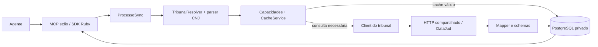

# MCP jurídico

Servidor MCP único em Ruby para consultar metadados públicos de processos, com
adaptadores por tribunal e cache central PostgreSQL/Supabase. TRF1, TJMT e STJ usam
exclusivamente a API Pública do DataJud/CNJ. STF está `unsupported`.

A [matriz de integração e pesquisa oficial](docs/integracoes.md) foi apresentada
antes da implementação. Ela registra fontes, autenticação, capacidades, limitações
contratuais e alternativas institucionais. Nenhuma disponibilidade em produção foi
homologada por consultas reais durante o desenvolvimento.

## Arquitetura



- `mcp/tools/`: quatro ferramentas genéricas, sem condicionais de tribunal.
- `tribunais/`: contrato `BaseClient`, parser, resolver e adaptadores registrados.
- `tribunais/datajud/`: transporte e normalização comuns aos três tribunais.
- `schemas/`: processo, parte, movimentação e documento serializáveis em JSON.
- `services/`: TTL, sincronização, capacidades e observabilidade.
- `repositories/`: consultas parametrizadas, transações e locks PostgreSQL.
- `db/migrations/`: sete tabelas de domínio; versionamento com checksum.

Para implementar um adaptador em outra linguagem, preserve o contrato dos três
métodos de `BaseClient`, capacidades e envelope canônico. Um futuro proxy RPC pode
ocupar o registro do client, sem alterar as ferramentas. Não há RPC externo nesta versão.

## Executar

Requisitos: Ruby >= 3.2, Bundler, PostgreSQL >= 14. As dependências estão fixadas em
`Gemfile.lock`. O SDK utilizado é o [SDK Ruby oficial MCP](https://github.com/modelcontextprotocol/ruby-sdk).

```bash
bundle config set --local path vendor/bundle
bundle install
cp .env.example .env
# Edite .env com DATABASE_URL, DATAJUD_API_KEY e contato no User-Agent.
# Use apenas arquivo local confiável; os scripts não carregam .env automaticamente.
set -a
source .env
set +a
bundle exec ruby bin/migrate
bundle exec ruby bin/mcp
```

Ao usar `source .env`, coloque valores com espaços entre aspas. Para produção,
injete variáveis pelo gerenciador de segredos/processos, sem arquivos versionados.
O servidor usa **stdio**, iniciado pelo host MCP como subprocesso; não abre porta HTTP.
`stdout` é exclusivo do protocolo, logs JSON saem em `stderr`.
Configure o host para executar `bundle exec ruby /caminho/absoluto/MPC-pge/bin/mcp`
com diretório de trabalho na raiz do projeto e as variáveis de ambiente acima.
Não distribua configurações contendo segredos. MCP remoto com autenticação não
foi implementado; o acesso nesta versão é controlado pelo host e usuário local.

## Smoke test DataJud sem MCP

Com as variáveis de ambiente já carregadas:

```bash
bundle exec ruby bin/smoke_datajud NUMERO_CNJ
# Forçar consulta real mesmo havendo cache válido:
CACHE_TTL_SECONDS=0 bundle exec ruby bin/smoke_datajud NUMERO_CNJ
```

O script chama `Juridico.build_service`, a mesma composição utilizada por
`Juridico.build` para o MCP, e executa `ProcessoSync.call` diretamente. Não cria
servidor, contexto ou resposta MCP. Consulta a fonte real em cache miss e persiste
normalmente no `DATABASE_URL`; cache hit mantém a data da consulta anterior.

O stdout contém somente resumo JSON: CNJ, tribunal, fonte, status, cache,
`consultado_em`, quantidade de capas, movimentos somados entre todas as capas e
duração (incluindo composição e consulta, em segundos). Movimentos são contados por
capa, sem deduplicação entre graus. Não imprime payload nem dados de partes.
Erros saem no stderr com classe, código de domínio quando disponível e mensagem
segura por allowlist; mensagens brutas de exceções são omitidas porque podem incluir
SQL, credenciais ou dados pessoais. Erros encerram com código 1 e a conexão é fechada.
Esse comando é uma consulta operacional real, separada dos testes com mocks.

## Matriz de smoke tests

```bash
TRF1_CNJ='...' TJMT_CNJ='...' STJ_CNJ='...' STF_CNJ='...' \
  bundle exec ruby bin/smoke_all_tribunais

# Alternativa: argumentos identificados, que prevalecem sobre o ambiente.
bundle exec ruby bin/smoke_all_tribunais TRF1_CNJ='...' TJMT_CNJ='...'
```

Substitua os exemplos por CNJs completos. O script usa as origens registradas no
`TribunalResolver`, uma única composição `Juridico.build_service` e chamadas diretas
ao mesmo serviço de `bin/smoke_datajud`, sequencialmente. Não adiciona retries;
preserva os limites do cliente, o cache e a persistência normal. Para garantir
consulta externa nas origens suportadas, use `CACHE_TTL_SECONDS=0`.

A tabela final contém tribunal, CNJ, status, código de erro, fonte, cache,
`consultado_em`, número de capas, movimentos somados entre capas e duração por
consulta (sem incluir a composição inicial). Erros não interrompem as demais linhas;
`not_found`, `incomplete_response`, `upstream_timeout`, `upstream_http_error` e
`unsupported_tribunal` aparecem como códigos distintos. STF permanece unsupported.
Respostas parciais não são persistidas; apenas a tentativa é auditada como erro.

CNJs ausentes geram `skipped / missing_cnj`. A origem é validada pelo resolver;
um CNJ de outra origem gera `tribunal_mismatch` sem consultar a fonte. Entradas
inválidas não são ecoadas. Em erros, campos sem resultado validado ficam como `-`,
inclusive cache e contagens: não representam zero resultados ou cache miss confirmado.
Falha na composição inicial é informada em todas as entradas fornecidas.
Mensagens brutas de exceções e payloads nunca entram no resumo.

Códigos de saída: 0 quando todas as consultas fornecidas têm sucesso; 1 quando
alguma falha (inclusive STF unsupported) ou ocorre erro no fechamento da conexão;
2 para argumentos inválidos ou nenhuma entrada. A conexão é fechada ao final.
Assim como os demais executáveis, o script não carrega `.env` automaticamente.

## Saúde dos índices DataJud

```bash
HEALTH_DATAJUD_TIMEOUT_SECONDS=10 bundle exec ruby bin/health_datajud
```

Requer a chave DataJud no ambiente, mas não requer `DATABASE_URL`. Não carrega
`boot.rb`, MCP, repositório ou serviço de sincronização. Reutiliza o transporte HTTP
e o registro de endpoints para sondar TRF1, TJMT e STJ sequencialmente, sem gravar
dados. Cada POST usa `size: 0`, `track_total_hits: false` e `match_all`, sem hits,
agregações ou paginação. Não imprime chave ou payload.

`HEALTH_DATAJUD_TIMEOUT_SECONDS` (padrão 10) limita o tempo total de cada sondagem,
incluindo eventual espera do limitador, e configura os timeouts de conexão/leitura.
Retries ficam obrigatoriamente em zero, independentemente de `HTTP_MAX_RETRIES`.
O transporte continua respeitando o limitador e cooldown de `Retry-After`; um
cooldown pode impedir o envio de sondagens posteriores, sem tentar contorná-lo.

A tabela mostra `tribunal | status | http_status | shards_total | shards_failed | duracao`:

- `healthy`: HTTP 200 e nenhum shard falho.
- `degraded`: HTTP 200 e um ou mais shards falhos.
- `down`: 429, 502, 503, 504, timeout, erro de conexão/TLS ou cooldown impeditivo.
- `error`: resposta inválida ou outro HTTP, incluindo 401/403; não comprova queda do índice.

Campos desconhecidos aparecem como `-`; duração em segundos. Exit code 0 significa
todos healthy, 1 indica alguma sondagem não saudável e 2 configuração inválida.
Uma consulta mínima saudável não garante que consultas processuais mais complexas
estejam saudáveis nem que os dados estejam completos ou atualizados.
As variáveis devem estar exportadas; `.env` não é carregado automaticamente.

## Ferramentas MCP

Todas recebem somente `{ "numero_cnj": "0000832-35.2018.4.01.3202" }`, ou número
completo sem pontuação (20 dígitos). O exemplo é o da documentação CNJ, não uma
consulta executada pelo projeto.

| Ferramenta | Comportamento |
|---|---|
| `buscar_processo` | Retorna todas as capas públicas da fonte selecionada; usa TTL |
| `buscar_movimentacoes` | Movimentos separados por capa/grau, fonte e data de consulta |
| `buscar_documentos` | Retorna `unsupported_capability` nas fontes atuais, sem download |
| `sincronizar_processo` | Ignora TTL e atualiza PostgreSQL; não escreve no tribunal |

Exemplo de envelope (campos resumidos):

```json
{
  "status": "ok",
  "cache": "hit",
  "consultado_em": "2026-10-07T12:00:00.000000Z",
  "capacidades": {"status":"supported","processo":true,"movimentacoes":true,"partes":false,"documentos":false,"fonte":"datajud"},
  "origem": {"tribunal":"TRF1","segmento":"4","regiao":"01","unidade":"3202","tipo":"unidade_primeiro_grau"},
  "processos": []
}
```

Em sucesso real, `processos` contém pelo menos uma capa. Cada item tem os campos
pedidos: `numero_cnj`, `tribunal`, `grau`, `classe`, `assuntos`, `orgao_julgador`,
`data_ajuizamento`, `situacao`, `partes`, `movimentacoes`, `documentos`, `fonte`.
Acrescenta `tribunal_origem`, `fonte_consulta` e `id_origem` para proveniência e identidade.
`fonte` inclui `sistema`, `sistema_origem`, `url_origem`, `consultado_em` e
`atualizado_na_fonte_em`. A URL é a API efetivamente consultada, não um link inventado
para o processo. Datas preservam o fuso informado; datas compactas sem fuso são
convertidas a ISO sem presumir timezone. Por isso datas **da origem** usam TEXT no
banco, enquanto timestamps de consulta/auditoria usam TIMESTAMPTZ.

`partes=[]` e `documentos=[]` significam ausência de fornecimento pela fonte,
explicitada nas capacidades; não significam que não existam no processo.
`situacao=null`: não se deduz situação jurídica a partir do último movimento.
A forma exata dos itens pode ser inspecionada nos [schemas](schemas/) e
[fixtures sintéticas](test/fixtures/). Complementos de movimento preservam a lista
`tabelados` e o órgão julgador, sem sobrescrever códigos repetidos.

Erros de execução MCP usam `isError: true`, com código e mensagem seguros:
`invalid_cnj`, `unsupported_tribunal`, `unsupported_capability`, `missing_credentials`,
`not_found`, `non_public_record`, `invalid_response`, `incomplete_response`,
`upstream_http_error`, `upstream_timeout`, `upstream_tls_error`, `rate_limited`,
`sync_busy`, `database_error`, `internal_error`. `not_found` não prova inexistência.
Não se retorna cache expirado como fallback de erro.

## Resolver e limites de cobertura

O parser valida formato, zeros, módulo 97, segmento, região e unidade conforme
[Resolução CNJ 65](https://atos.cnj.jus.br/atos/detalhar/119). Registro inicial:
`4.01 → TRF1`, `8.11 → TJMT`, `3.00 → STJ`, `1.00 → STF`.
Unidade 0000, 9xxx e 9999 recebem classificação distinta. Não há catálogo local que
confirme nome/existência de cada vara; o código é preservado sem inferir o grau atual.

O número identifica **origem**, não necessariamente tramitação atual. Recursos no
STJ podem conservar número de outro tribunal; esta versão não faz busca federada em
outros índices e não aceita o nome do tribunal como substituto do resolver. STF
retorna: “Não foi possível confirmar uma API pública oficial adequada.”

DataJud não é consulta em tempo real nem fornece inteiro teor. A fonte pode atrasar,
mudar ou retornar várias capas. Paginação é limitada localmente a 1.000 registros
por número; resultados inexatos, duplicados entre páginas, parciais e falhas de
shards são rejeitados. Ausência de `nivelSigilo=0` também causa rejeição conservadora.

## PostgreSQL / Supabase

Use conexão PostgreSQL direta ou pool em modo **session**. Não use pool transacional:
o lock de sincronização é um advisory lock de sessão. O repositório serializa o uso
da conexão e evita duas sincronizações simultâneas do mesmo número entre processos.
O servidor stdio atual processa requisições sequencialmente.

Tabelas no schema privado `juridico`: `processos`, `partes`, `processo_partes`,
`movimentacoes`, `documentos`, `fontes_consulta`, `sincronizacoes`. `processos`
guarda snapshot JSONB, assuntos e índice por número normalizado, com unicidade por
número/tribunal/id de origem. Capas distintas não são sobrescritas entre si.

Snapshot, relacionamentos e auditoria de sucesso são persistidos na mesma transação.
Movimentos usam fingerprint; documentos usam identificador; vínculos de partes
são deduplicados. Pessoas sem documento não são fundidas entre processos só pelo
nome. Um resultado completo substitui capas/filhos atuais; a auditoria mantém hashes.
Falha faz rollback e registra o código, sem mensagem bruta potencialmente sensível.
Tentativas sem resultado têm `processo_id=null`. Encerramento abrupto pode deixar
sincronização `running`; ela é evidência de tentativa interrompida, não sucesso.

TTL não renova em erro. `not_found` ou retorno não público invalidam cache anterior.
Dentro do TTL não há como detectar mudança superveniente de sigilo sem nova consulta;
reduza TTL ou force sincronização conforme a necessidade institucional.

`STORE_RAW_PAYLOAD=true` guarda a última resposta pública validada em JSONB; não é
histórico integral de todos os payloads. Cada sincronização preserva hash para auditoria.
Payloads rejeitados não são armazenados. Defina retenção e backups de acordo com o uso.
O schema revoga acesso de PUBLIC. Não o exponha no PostgREST/Supabase; use usuário de
backend dedicado com privilégios mínimos. Não há acesso de navegador às tabelas.
Use TLS e validação de certificado na conexão remota (`sslmode=verify-full` e CA adequada).

## Variáveis de ambiente

| Variável | Padrão / função |
|---|---|
| `DATABASE_URL` | Obrigatória; conexão PostgreSQL do backend |
| `DATAJUD_API_KEY` | Necessária para consulta; chave vigente na [wiki CNJ](https://datajud-wiki.cnj.jus.br/api-publica/acesso/) |
| `CACHE_TTL_SECONDS` | 3600; zero desabilita leitura de cache |
| `HTTP_OPEN_TIMEOUT_SECONDS` | 5 |
| `HTTP_READ_TIMEOUT_SECONDS` | 20; aplicado à leitura e escrita |
| `HTTP_MAX_RETRIES` | 2; aceito de 0 a 3 |
| `HTTP_MIN_INTERVAL_SECONDS` | 1; limitador compartilhado entre tribunais neste processo |
| `HTTP_MAX_RETRY_WAIT_SECONDS` | 30; espera maior falha e preserva cooldown |
| `HTTP_USER_AGENT` | `MCP-Juridico/0.1`; configure contato institucional |
| `STORE_RAW_PAYLOAD` | false |
| `METRICS_PATH` | Opcional; arquivo textfile Prometheus, fora do stdout |
| `TEST_DATABASE_URL` | Somente testes de banco descartável terminado em `_test` |

Retries somente para falhas transitórias, HTTP 429 e 5xx, com backoff exponencial,
jitter e respeito a `Retry-After` em segundos ou data HTTP. 401/403 não têm retry;
redirecionamentos não são seguidos. Endpoint é fixo em HTTPS e host permitido.
Respostas têm limite local de 10 MiB. Não há circuit breaker adicional: retries são
limitados e respostas com Retry-After estabelecem cooldown entre chamadas. Em múltiplas
réplicas o limitador HTTP é local; antes de escalar, implementar coordenação central
para a quota compartilhada da chave.

HTTP 200 com `_shards.failed > 0` gera `incomplete_response`, com a mensagem
“A fonte respondeu parcialmente e não foi possível validar o resultado.”, antes de
interpretar hits (mesmo vazios). Não há retry automático para respostas 200 parciais;
nenhuma capa/payload parcial é persistida e o TTL não é renovado. A tentativa de
sincronização é auditada como erro. O evento `datajud_partial_response` registra
somente tribunal, HTTP status, contagens total/successful/failed de shards e duração,
sem motivos livres de falha, payload ou credenciais. Os logs HTTP indicam apenas o
resultado do transporte; a aceitação dos dados depende da validação do cliente.

Logs contêm tribunal, ferramenta, duração em segundos, status, cache hit/miss e HTTP
status. Não registram tokens, parâmetros, CPF, payload, SQL ou URL do banco.
Métricas textfile: `mcp_requests_total`, `tribunal_requests_total`,
`tribunal_request_duration_sum`, `tribunal_request_duration_count`,
`tribunal_errors_total`, `cache_hits_total`. Contadores são locais ao processo;
configure um arquivo por instância e coleta do Prometheus. Duração é sum/count em
segundos. Chamadas inválidas rejeitadas pelo próprio SDK antes da ferramenta não
passam pela instrumentação do serviço.

## Testes

```bash
bundle exec rake test
# Opcional, banco dedicado/descartável: os testes truncam o schema juridico.
TEST_DATABASE_URL=postgresql://localhost/mcp_juridico_test bundle exec rake test:db
```

Testes unitários bloqueiam Net::HTTP e usam fixtures sintéticas; não dependem dos
tribunais ou de credenciais reais. Testes de banco ficam em tarefa separada,
desativada por padrão. Cobrem migrations, roundtrip, rollback, múltiplas capas,
auditoria, exclusão de dados antigos, deduplicação e locks. Não há smoke test público
habilitado automaticamente.

## Como adicionar um novo tribunal

1. Pesquisar documentação oficial, termos, autenticação e capacidades; registrar evidência.
2. Criar client que implemente `Tribunais::BaseClient` (ou reutilize DataJud se documentado).
3. Criar mapper para o modelo canônico; rejeitar sigilo e identidade divergente.
4. Registrar origem em `TribunalResolver::ORIGENS` e client na composição de `boot.rb`.
5. Adicionar fixtures sintéticas e testes de parser, mapper, client e erros.
6. Atualizar a matriz de capacidades e documentação. Sem contrato confirmado, manter
   `pending`/`unsupported` com motivo; nunca substituir por scraping.

Antes de operação, observar as restrições de finalidade e exploração comercial dos
[termos oficiais DataJud](https://datajud-wiki.cnj.jus.br/api-publica/termo-uso/).
Alternativas institucionais MNI e datalake permanecem pendentes de contrato e acesso.
